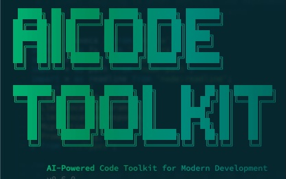

[](https://fastmcp.me/MCP/Details/1332/scaffold-generator)
[](https://fastmcp.me/MCP/Details/1332/scaffold-generator)
[](https://fastmcp.me/MCP/Details/1332/scaffold-generator)
[](https://fastmcp.me/MCP/Details/1332/scaffold-generator)
[](https://fastmcp.me/MCP/Details/1332/scaffold-generator)
[](https://fastmcp.me/MCP/Details/1332/scaffold-generator)

# AI Code Toolkit

> Scale your AI coding agents with scaffolding, architecture patterns, and validation rules

[](https://www.npmjs.com/package/@agiflowai/scaffold-mcp)
[](https://opensource.org/licenses/AGPL-3.0)
[](https://discord.gg/NsB6q9Vas9)



A collection of [Model Context Protocol (MCP)](https://modelcontextprotocol.io) servers and tools that help AI coding agents maintain consistency, follow conventions, and scale with your codebase.

---

## Contents

- [Why This Exists](#why-this-exists)
- [Core Pillars](#core-pillars)
- [Our Approach](#our-approach)
- [Getting Started](#getting-started)
  - [Prerequisites](#prerequisites)
  - [Quick Start](#quick-start)
- [Project Structure Support](#project-structure-support)
  - [Monorepo (Default)](#monorepo-default)
  - [Monolith](#monolith-new)
  - [Creating Projects](#creating-projects)
  - [Adding Features](#adding-features)
- [Development Workflow](#development-workflow)
- [Packages](#packages)
- [Supported Integrations](#supported-integrations)
  - [Coding Agents](#coding-agents)
  - [Spec-Driven Development Tools](#spec-driven-development-tools)
- [Contributing](#contributing)
- [License](#license)

---

## Why This Exists

As projects evolve from MVP to production, they develop patterns, conventions, and opinionated approaches. Custom instructions alone struggle to ensure AI agents follow these requirements—especially as complexity grows and context windows fill up.

**AI Code Toolkit provides building blocks to scale coding agent capabilities:**

- ✅ Generate code that follows your team's conventions
- ✅ Enforce architectural patterns automatically
- ✅ Validate agent outputs programmatically
- ✅ Work with any AI coding agent (Claude, Cursor, etc.)
- ✅ Support any tech stack (Next.js, React, or custom frameworks)

### The Perfect Complement to Spec Driven Development

While **Spec Driven Development** tells AI agents *what* to build (requirements, features, behavior), **AI Code Toolkit** tells them *how* to build it (patterns, conventions, validation). Together, they create a complete development workflow:

- **Specs** → Define product requirements and business logic
- **AI Code Toolkit** → Enforce technical standards and architectural consistency

Whether you're bootstrapping a new project or managing a complex monorepo, these tools ensure AI agents integrate seamlessly with your development workflow.

---

## Core Pillars

### 1. Scaffolding Templates

Combine templating with LLMs to generate standardized code that follows your internal conventions while reducing maintenance overhead.

### 2. Architecture + Design Patterns

Convention over configuration scales. Like Ruby on Rails or Angular, opinionated approaches make code predictable—for both humans and AI agents.

### 3. Rules

Pre-flight guidance + post-flight validation = consistent output. Rules provide programmatic checks (quantitative or qualitative) to enforce your processes.

---

## Our Approach

### Agent Agnostic

Works with any AI coding agent (Claude Code, Cursor, Windsurf, etc.). Each library provides:
- **MCP tools** for integration with MCP-compatible agents
- **CLI commands** for scripting deterministic workflows

### Tech Stack Agnostic

Built-in templates for popular frameworks:
- Next.js 15
- TypeScript Libraries & MCP Packages
- _More coming soon (Vite + React, Remix, etc.)_

Don't see your stack? Use the built-in MCP tools to generate custom templates—the system is fully extensible.

### Coding Tool Specific

Maximize effectiveness by combining three layers:

1. **MCP Servers** → Let tools guide the agent with their default prompts
2. **Custom Instructions** → Use `CLAUDE.md`, `AGENTS.md` to specify when to use MCP tools
3. **Hooks** → Intercept tool calls to enforce workflows (e.g., require scaffolding for new files)

Experiment with these layers to find the right balance for your project. There's no one-size-fits-all solution.

---

## Getting Started

### Prerequisites

- **Node.js**: `>= 18` (LTS recommended)
- **Package Manager**: `pnpm` (or `npm`/`yarn`)
- **Git**: `>= 2.13.2`

### Quick Start

Get started with AI Code Toolkit in 3 simple steps:

#### Step 1: Initialize Templates (or Create New Project)

**For Existing Projects:**

Run the init command to download official templates:

```bash
npx @agiflowai/aicode-toolkit init
```

This automatically downloads official templates (Next.js 15, TypeScript libraries, MCP packages) to your workspace.

**For New Projects:**

Run init without a git repository and it will guide you through creating a new project:

```bash
# Interactive mode (recommended)
npx @agiflowai/aicode-toolkit init

# Non-interactive mode
npx @agiflowai/aicode-toolkit init --name my-project --project-type monolith
```

The command will prompt you for project details, initialize git, and download templates.

#### Step 2: Configure MCP Servers

Add the MCP servers to your AI coding tool's configuration:

**For Claude Code, Cursor, Windsurf, or any MCP-compatible tool:**

Add to your MCP settings (e.g., `claude_desktop_config.json`, `.cursor/mcp.json`):

```json
{
  "mcpServers": {
    "scaffold-mcp": {
      "command": "npx",
      "args": ["-y", "@agiflowai/scaffold-mcp", "mcp-serve", "--admin-enable"]
    },
    "architect-mcp": {
      "command": "npx",
      "args": [
        "-y", "@agiflowai/architect-mcp", "mcp-serve",
        "--admin-enable",
        "--design-pattern-tool", "claude-code",
        "--review-tool", "claude-code"
      ]
    }
  }
}
```

**Note for Claude Code users:** You can also use the [plugin marketplace](./docs/claude-code/MARKETPLACE.md) for automatic configuration.

#### Step 3: Use MCP Tools and Slash Commands

Once configured, your AI agent has access to:

**Scaffolding Tools (scaffold-mcp):**
- `list-boilerplates` - Show available project templates
- `use-boilerplate` - Create new project from template
- `list-scaffolding-methods` - Show features you can add to existing projects
- `use-scaffold-method` - Add features (pages, components, API routes, etc.)

**Architecture Tools (architect-mcp):**
- `get-file-design-pattern` - Get design patterns for a specific file
- `review-code-change` - Review code against rules and standards

**Slash Commands** (for compatible agents like Claude Code):
- `/scaffold-mcp:scaffold-application` - Create a new application
- `/scaffold-mcp:scaffold-feature` - Add features to existing projects
- `/scaffold-mcp:generate-boilerplate` - Create custom boilerplate templates
- `/scaffold-mcp:generate-feature-scaffold` - Create custom feature scaffolds

**Available Templates:**
- **nextjs-15-drizzle**: Next.js 15 + App Router + TypeScript + Tailwind CSS 4 + Storybook + Optional Drizzle ORM
- **typescript-lib**: TypeScript library with ESM/CJS builds, testing, and documentation
- **typescript-mcp-package**: Model Context Protocol (MCP) server package template

---

## Project Structure Support

AI Code Toolkit supports both **monorepo** and **monolith** project architectures. The tools automatically detect your project type and adapt accordingly.

### Monorepo (Default)

Multi-project workspaces using tools like Nx, Lerna, or Turborepo:

```
my-workspace/
├── apps/
│   ├── web-app/
│   │   ├── project.json  ← sourceTemplate: "nextjs-15"
│   │   └── src/
│   └── mobile-app/
│       ├── project.json  ← sourceTemplate: "react-native"
│       └── src/
└── packages/
    └── shared-lib/
        ├── project.json  ← sourceTemplate: "typescript-lib"
        └── src/
```

**Configuration**: Each project has `project.json` with `sourceTemplate` field

### Monolith (New!)

Single-application codebases:

```
my-app/
├── toolkit.yaml  ← projectType: monolith, sourceTemplate: "react-vite"
├── package.json
├── src/
└── public/
```

**Configuration**: `toolkit.yaml` at workspace root with `projectType` and `sourceTemplate`

```yaml
version: "1.0"
projectType: monolith
sourceTemplate: react-vite  # Your template identifier
```

**Alternative**: Configure via `package.json`:
```json
{
  "name": "my-app",
  "scaffold": {
    "sourceTemplate": "react-vite"
  }
}
```

### Creating Projects

**New Project with Interactive Setup** (recommended):
```bash
# Run init without a git repository - it will prompt for project details
npx @agiflowai/aicode-toolkit init

# Interactive prompts will ask for:
# - Project name
# - Project type (monolith or monorepo)
# - Git repository setup
# - Template download
```

**New Project with CLI Options** (non-interactive):
```bash
# Create a monolith project
npx @agiflowai/aicode-toolkit init \
  --name my-app \
  --project-type monolith

# Create a monorepo project
npx @agiflowai/aicode-toolkit init \
  --name my-workspace \
  --project-type monorepo
```

**Existing Workspace** (just initialize templates):
```bash
# In an existing git repository
npx @agiflowai/aicode-toolkit init

# With custom templates path
npx @agiflowai/aicode-toolkit init --path custom-templates
```

### Adding Features

Use scaffold-mcp MCP tools to add features. The tools automatically detect your project type:

**MCP Tools:**
- `list-scaffolding-methods` - See available features for your project
- `use-scaffold-method` - Add pages, components, routes, etc.

**CLI Alternative:**
For manual usage, see the [@agiflowai/aicode-toolkit](./apps/aicode-toolkit/README.md) CLI documentation.

**Key Points**:
- Templates are **architecture-agnostic** (same templates work for both)
- Tools **auto-detect** project type from configuration files
- Use `--project-type monolith` option when creating new projects with `init` command
- Configuration priority: `project.json` → `toolkit.yaml` → `package.json`

---

## Development Workflow

The AI Code Toolkit packages work together to create a complete development workflow for AI coding agents. Here's how they integrate:

### Complete Workflow: From Project Creation to Code Review

```
1. Bootstrap Project (aicode-toolkit)
   ↓
   aicode init → Creates project with template
   ↓
   Result: Project with architect.yaml + RULES.yaml from template

2. Get Design Guidance (architect-mcp)
   ↓
   architect-mcp get-file-design-pattern → Shows patterns for file
   ↓
   Result: AI agent understands architectural patterns to follow

3. Write Code (AI Agent)
   ↓
   Agent writes code following design patterns
   ↓
   Result: Code implementation

4. Review Code (architect-mcp)
   ↓
   architect-mcp review-code-change → Validates against rules
   ↓
   Result: Violations identified, feedback provided

5. Add Features (scaffold-mcp)
   ↓
   scaffold-mcp MCP tools → Adds new features/components
   ↓
   Result: Consistent code following patterns
```

### How They Work Together

**scaffold-mcp** and **architect-mcp** are complementary:

| Tool | Purpose | When to Use |
|------|---------|-------------|
| **scaffold-mcp** | Generate code from templates | Creating new projects, adding standard features (routes, components) |
| **architect-mcp** | Guide and validate code | Understanding patterns, reviewing code quality |

**Integration Points:**

1. **Shared Templates**: Both use the same template structure
   ```
   templates/nextjs-15/
   ├── scaffold.yaml         ← scaffold-mcp: Defines boilerplates/features
   ├── architect.yaml        ← architect-mcp: Defines design patterns
   └── RULES.yaml            ← architect-mcp: Defines coding rules
   ```

2. **Project Configuration**: Projects reference templates via `project.json`
   ```json
   {
     "name": "my-app",
     "sourceTemplate": "nextjs-15"
   }
   ```

3. **Workflow Stages**:
   - **Pre-coding**: scaffold-mcp generates boilerplate → architect-mcp shows patterns
   - **During coding**: architect-mcp provides guidance → AI agent writes code
   - **Post-coding**: architect-mcp reviews code → Identifies violations
   - **Iteration**: scaffold-mcp adds features → architect-mcp validates

### Example: Building a Next.js Application

**Step 1: Create Project**
AI agent uses scaffold-mcp MCP tool `use-boilerplate` to create the application.

Result: Project created with Next.js structure, architect.yaml, and RULES.yaml

**Step 2: Understand Patterns** (Before writing custom code)
AI agent uses architect-mcp MCP tool `get-file-design-pattern` to understand patterns.

Result: Shows "Next.js App Router Pattern" and applicable rules

**Step 3: Add Feature** (Standard features)
AI agent uses scaffold-mcp MCP tool `use-scaffold-method` to add a route.

Result: Route created following template patterns

**Step 4: Write Custom Code** (AI agent writes business logic)
```typescript
// AI agent adds product fetching logic following patterns shown
export default async function ProductsPage() {
  const products = await fetchProducts(); // Custom logic
  return <div>{/* render products */}</div>;
}
```

**Step 5: Review Code**
AI agent uses architect-mcp MCP tool `review-code-change` to validate the code.

Result: Validates against RULES.yaml (named exports, error handling, etc.)

### Why This Approach Works

1. **Templates as Single Source of Truth**: Both tools read from same template definitions
2. **Separation of Concerns**:
   - scaffold-mcp: Generates repetitive code
   - architect-mcp: Guides unique code
3. **Progressive Enhancement**:
   - Start with scaffolding (fast, consistent)
   - Add custom logic (AI-assisted, pattern-guided)
   - Validate output (automated review)
4. **Feedback Loop**: Reviews inform future scaffolding and patterns

---

## Packages

### [@agiflowai/aicode-toolkit](./apps/aicode-toolkit)

Unified CLI for initializing projects, managing templates, and configuring MCP servers. Provides interactive workflows for project setup with automatic detection of coding agents (Claude Code, Cursor, Gemini CLI, Codex CLI, GitHub Copilot).

**Key Features:**
- Interactive project initialization (monorepo or monolith)
- Template management and download from GitHub
- Automatic MCP server configuration
- Coding agent auto-detection
- New project scaffolding with git setup

[View full documentation →](./apps/aicode-toolkit/README.md)

### [@agiflowai/scaffold-mcp](./packages/scaffold-mcp)

MCP server for scaffolding applications with boilerplate templates and feature generators. Works with any MCP-compatible coding agent.

**Key Features:**
- Create projects from boilerplate templates
- Add features to existing projects (pages, components, services)
- Template management (initialize, add from repositories)
- Built-in templates: Next.js 15, TypeScript libraries, MCP packages
- Multiple transport modes: stdio, HTTP, SSE
- Standalone CLI and slash command prompts

[View full documentation →](./packages/scaffold-mcp/README.md)

### [@agiflowai/architect-mcp](./packages/architect-mcp)

MCP server for architecture design, code quality enforcement, and design pattern guidance. Validates code against project-specific rules and patterns.

**Key Features:**
- Design pattern guidance for specific files
- Code review against template-specific rules
- Architecture patterns (architect.yaml)
- Coding standards and rules (RULES.yaml)
- Optional LLM-powered analysis
- Multiple transport modes: stdio, HTTP, SSE

[View full documentation →](./packages/architect-mcp/README.md)

### [@agiflowai/coding-agent-bridge](./packages/coding-agent-bridge)

Service layer for integrating with AI coding agents. Provides a unified interface for detecting, configuring, and invoking different coding assistants programmatically.

**Key Features:**
- Automatic coding agent detection (Claude Code, Cursor, Gemini CLI, etc.)
- Unified interface for MCP configuration and custom instructions
- LLM invocation API for using coding agents as pure LLMs
- Agent-specific adapters with consistent API
- Support for stdio, HTTP, and SSE transports

**Currently Supported Coding Agents:**
- **Claude Code** - Full support with `.mcp.json` configuration and CLAUDE.md/AGENTS.md instructions
- **Cursor** - MCP configuration and .cursorrules instructions
- **Gemini CLI** - .gemini workspace detection and configuration
- **Codex CLI** - .codex workspace detection and configuration
- **GitHub Copilot** - MCP support and .github/copilot-instructions.md

**Coming Soon:**
- Windsurf
- Zed
- VS Code with Continue/Cody extensions

[View full documentation →](./packages/coding-agent-bridge/README.md)

---

## Supported Integrations

### Coding Agents

AI Code Toolkit integrates with popular AI coding assistants through the `coding-agent-bridge` package:

| Agent | Status | MCP Support | Custom Instructions | LLM API |
|-------|--------|-------------|---------------------|---------|
| **Claude Code** | ✅ Supported | `.mcp.json` | `CLAUDE.md`, `AGENTS.md` | ✅ |
| **Cursor** | ✅ Supported | `.cursorrules` | `.cursorrules` | ⏳ |
| **Gemini CLI** | ✅ Supported | `.gemini` | `.gemini` | ⏳ |
| **Codex CLI** | ✅ Supported | `.codex` | `.codex` | ⏳ |
| **GitHub Copilot** | ✅ Supported | MCP | `.github/copilot-instructions.md` | ⏳ |
| **Windsurf** | 🔄 Coming Soon | MCP | Custom | ⏳ |
| **Zed** | 🔄 Planned | MCP | Custom | ⏳ |
| **VS Code + Continue** | 🔄 Planned | MCP | `.continuerc.json` | ⏳ |

**Features:**
- **Auto-detection**: Automatically detects installed coding agents in your workspace
- **Unified API**: Same interface for all agents (configuration, instructions, invocation)
- **MCP Configuration**: Programmatic setup of MCP servers
- **LLM Invocation**: Use coding agents as pure LLMs (no tool use)

### Spec-Driven Development Tools

AI Code Toolkit supports spec-driven development through the `aicode-toolkit` CLI:

| Tool | Status | Description | Documentation |
|------|--------|-------------|---------------|
| **OpenSpec** | ✅ Supported | Spec-driven development for AI coding assistants | [OpenSpec GitHub](https://github.com/Fission-AI/OpenSpec) |
| **SpecKit** | 🔄 Planned | Lightweight spec framework for AI agents | Coming Soon |

**How It Works:**
```bash
# Initialize OpenSpec in your project
npx @agiflowai/aicode-toolkit init

# The toolkit automatically:
# 1. Detects your coding agent (Claude Code, Cursor, etc.)
# 2. Configures OpenSpec integration
# 3. Updates agent instructions with OpenSpec workflows
# 4. Coordinates MCP servers (scaffold-mcp, architect-mcp)
```

---

## Contributing

We welcome contributions! Whether it's bug reports, feature requests, or pull requests—all contributions are appreciated.

**How to contribute:**

1. Fork the repository
2. Create a feature branch (`git checkout -b feature/amazing-feature`)
3. Make your changes
4. Run tests and linting (`pnpm test && pnpm lint`)
5. Commit your changes (follow [conventional commits](https://www.conventionalcommits.org))
6. Push to your branch (`git push origin feature/amazing-feature`)
7. Open a Pull Request

See [CONTRIBUTING.md](./CONTRIBUTING.md) for detailed guidelines.

---

## License

[AGPL-3.0](./LICENSE) © AgiflowIO

---

**Built with ❤️ by the AgiflowIO team**

- [Report Issues](https://github.com/AgiFlow/aicode-toolkit/issues)
- [Discussions](https://github.com/AgiFlow/aicode-toolkit/discussions)
- [Discord Community](https://discord.gg/NsB6q9Vas9)
- [Website](https://agiflow.io)
